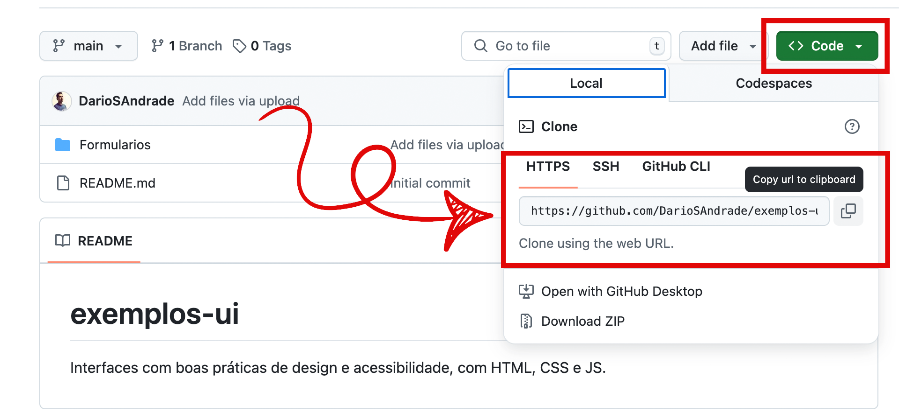

# 🔁 Como clonar um repositório do GitHub e executar um projeto localmente

Este tutorial passo a passo mostra como clonar um repositório do GitHub e rodar um projeto no seu computador local. Ideal para iniciantes que ainda não têm muita familiaridade com Git, GitHub ou linha de comando.

---

## ✅ Pré-requisitos

- Conta no GitHub
- Git instalado na máquina
- VS Code (ou outro editor de código)
- Acesso à internet

---

## 🧭 Passo a passo

### 1. Acesse o repositório desejado no GitHub

Navegue até o repositório que você quer clonar. Exemplo: `https://github.com/usuario/repositorio`

### 2. Clique no botão verde `Code` e copie o link

Escolha a opção HTTPS e copie o link exibido.



### 3. Abra o terminal (ou Git Bash) e execute o comando:

```bash
git clone https://github.com/usuario/repositorio.git
```

Isso criará uma pasta com o projeto no seu computador.

### 4. Acesse a pasta e abra o projeto no VS Code:

```bash
cd repositorio
code .
```

### 5. Execute o projeto (exemplo com HTML):

Se for um projeto web simples (HTML/CSS/JS), basta abrir o arquivo `index.html` no navegador.

---

## 🛠️ Dicas de erros comuns

- **Erro de autenticação:** certifique-se de que o repositório é público ou que você tem acesso.
- **Git não reconhecido:** verifique se o Git está instalado e configurado (`git --version`).

---

## 🔗 Referências

- [Guia Oficial do GitHub](https://docs.github.com/pt)
- [Instalação do Git](https://git-scm.com/book/pt-br/v2/Primeiros-passos-Instalando-Git)
- [Visual Studio Code](https://code.visualstudio.com/)

---

💡 _Este é um dos primeiros passos para começar a usar o GitHub com confiança!_

